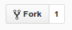
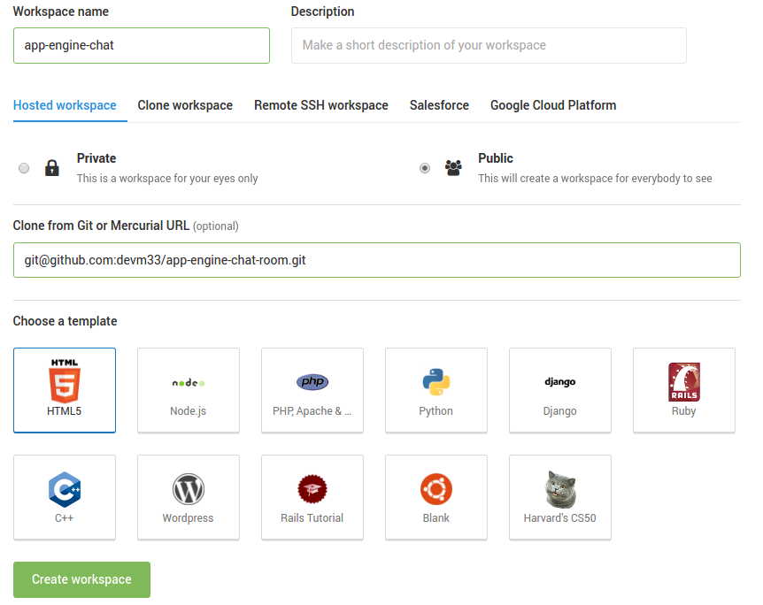
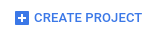
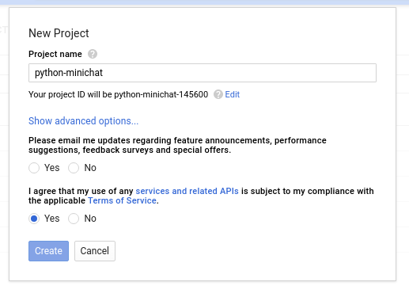

# A simple chat room for App Engine

First project for Scripted Studio at Google!

Check out the example here: <https://scripted-studio-chat.appspot.com/>

## Instructions

1.  Fork this repo  and create a [new clou9
    workspace](https://c9.io/new/) for your fork. Be sure to clone your repo
    when creating your cloud9 workspace:

    

1.  Go to <https://console.cloud.google.com/appengine> sign in and click on
    CREATE PROJECT.

    If you already have App Engine projects click the dropdown in the top left
    to create a new one.

    

1.  Choose a project name for your project.

    

    Note the project ID in the above dialog: `python-minichat-145600` This will
    be the subdomain of the url to your project, e.g.
    python-minichat-145600.appspot.com

    You can edit this ID if you like by clicking the Edit button and finding
    your own unique ID.

1.  In your cloud9 workspace open a terminal and run the following command:

    ```sh
    curl https://dl.google.com/dl/cloudsdk/release/install_google_cloud_sdk.bash | bash
    ```

    Hit enter each time when prompted to use the default settings.

1.  Authenticate with the google cloud api by running:

    ```sh
    ~/google-cloud-sdk/bin/gcloud init
    ```

    This command will print a url for you to open in a new tab. When you go to
    that url you will get a code that you need to copy/paste back in the
    terminal.

    Select the project name you created before from the list when prompted.

1.  Deploy your project by running

    ```sh
    ~/google-cloud-sdk/bin/gcloud app deploy
    ```

    Make sure to do this from the directory where the app-engine-chat-room code
    is.

1.  Once your project is deployed open it up in a browser by going to
    your-project-id.appspot.com

1.  Change the url at the top of this README to your-project-id.appspot.com

1.  Now that your instance of the chat room is deployed customize it to your
    design. Try modifying the CSS or changing the Python code to have new
    behavior. Read through the code walk-through below to learn how the app
    works and get ideas for what you can add or change.

## Code Walk-through

There are two files with code for this project and one config file. Let's walk
through them to see what they are doing to make the application work.

### [`main.py`](main.py)

The main python file, `main.py`, consists of four handlers for different
actions. Each handler is bound to a url at the end of the file when the
application is defined:

```py
app = webapp2.WSGIApplication([
  ('/', HandleMain),
  ('/send', HandleSend),
  ('/_ah/channel/connected/', HandleConnect),
  ('/_ah/channel/disconnected/', HandleDisconnect),
], debug=True)
```

`HandleMain` is the first entry point to the application. This handler is called
when the web page is loaded and it returns the `index.html` file to the browser.

The first thing it does is save the user loading the page to the database and
open a channel for that user.

```py
class HandleMain(webapp2.RequestHandler):
  """ Renders index.html an initializes the chat room channel. """
  @login_required
  def get(self):
    user = users.get_current_user()
    chat_user = ChatUser.get_or_insert(user.user_id(),
                                       nickname = user.nickname())

    token = channel.create_channel(chat_user.key.string_id())
    template = jinja_environment.get_template('index.html')
    self.response.out.write(template.render({ 'token': token }))
```

`HandleSend` is called when the javascript application on the frontend send a
new chat message to the backend. Once it receives the message it then sends out
that message to each connected user.

```py
class HandleSend(webapp2.RequestHandler):
  """ When a user sends a message to be echoed to all other users. """
  def post(self):
    user_id = users.get_current_user().user_id()
    chat_user = ChatUser.get_by_id(user_id)

    data = self.request.get('data')
    for recipient in ChatUser.query():
      channel.send_message(recipient.key.string_id(),
                           '%s: %s' % (chat_user.nickname, cgi.escape(data)))
```

`HandleConnect` is called when the channel for a new user is ready to be used.
Similar to `HandleSend` it also broadcasts out to every user that a new user has
joined the chat room.

```py
class HandleConnect(webapp2.RequestHandler):
  """ Send a welcome message and notifies all other users. """
  def post(self):
    user_id = self.request.get('from')
    chat_user = ChatUser.get_by_id(user_id)

    existing_users = ChatUser.query(ChatUser.key != chat_user.key)
    channel.send_message(chat_user.key.string_id(),
                         'Welcome, %s! Other chatters: %d' %
                         (chat_user.nickname, existing_users.count()))
    for existing_user in existing_users:
      channel.send_message(existing_user.key.string_id(),
                           '%s joined' % chat_user.nickname)
```

`HandleDisconnect` is called when a user closes the web page. It deletes the
user from the database so the application doesn't try to send messages to the
user anymore. And it also broadcasts the exit out.

```py
class HandleDisconnect(webapp2.RequestHandler):
  """ Deletes the user model and notifies all other users. """
  def post(self):
    user_id = self.request.get('from')
    chat_user = ChatUser.get_by_id(user_id)
    chat_user.key.delete()

    for user in ChatUser.query():
      channel.send_message(user.key.string_id(), '%s left' % chat_user.nickname)
```

Finally the users are stored in the database in the format described by the
`ChatUser` class. And this class is used to save, delete, and query users.

```py
class ChatUser(ndb.Model):
  """ Stored user model. Should be keyed by the User ID. """
  nickname = ndb.StringProperty()
```

### [`index.html`](index.html)

The `index.html` file has both the html and javascript in it. First the html
consists of a `div` to contain the chat messages and an `input` tag where user
sends chat messages.

```html
<div id="chat">
  <div id="messages"></div>
  <input disabled placeholder="Connecting..." id="newmessage"></input>
</div>
```

Next the html imports jQuery and the api for App Engine channels.

```html
<script src='//ajax.googleapis.com/ajax/libs/jquery/3.1.1/jquery.min.js'>
</script>
<script src='/_ah/channel/jsapi'></script>
```

In the application javascript we start off by saving the jQuery objects for the
two html elements from above.

```html
<script>
  var messages = $('#messages');
  var newmessage = $('#newmessage');
```

Then we use the library imported from `/_ah/channel/jsapi` to open a channel to
the backend. Note here the value `{{ token }}` is replaced when the `index.html`
is served with the unique token string created in `main.py`.

```js
  // Wire up the channel event handlers.
  var channel = new goog.appengine.Channel('{{ token }}');
  var handler = {
    'onopen': function() {
      // Let the chatting begin.
      newmessage.attr('placeholder', 'Send a message');
      newmessage.attr('disabled', false);
      newmessage.focus();
    },
    'onmessage': function(m) {
      // Blindly append the message to the end of the element.
      messages.append('<p class="message">' + m.data + '</p>');
    },
    'onerror': function() {}, // No-op.
    'onclose': function() {}, // No-op.
  };
channel.open(handler);
```

Finally, we listen for the user pressing enter on the chat input and send the
chat message. We also bind to the user clicking outside of the chat input and
return focus to it in order to make sure it's always easy to send a new chat
message.

```js
// Enter-button handler, i.e. send a message.
newmessage.on('keypress', function(e) {
  if (e.key === 'Enter' && newmessage.val() !== '') {
    $.post('/send', {data: newmessage.val()});
    newmessage.val('');
  };
});

// Force all focus to the input box.
newmessage.on('blur', function(e) {
  newmessage.focus();
});
```

### [`app.yaml`](app.yaml)

The `app.yaml` file is a config file that App Engine uses to run the application
when it's deployed. The first three lines of the file set up the project to run
a python backend.

```yaml
runtime: python27
api_version: 1
threadsafe: true
```

The next section of the file connects the urls to the `main.py` file.
`inbound_services` sets up the internal `/_ah/channel/` urls for receiving the
connect and disconnect notifications.

`````yaml
inbound_services:
- channel_presence

handlers:
- url: /.*
  script: main.app
````

Finally, App Engine needs to know about the third party libaries our python
application uses.

```yaml
libraries:
- name: webapp2
  version: "2.5.2"
- name: jinja2
  version: "2.6"
`````
